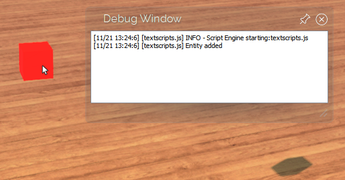

# Write Your Own Scripts

Vircadia's robust [JavaScript API](https://apidocs.vircadia.dev) provides the tools for you to build great content and user experiences in VR.

In this section, you can find simple code samples to do common tasks in Vircadia. To see these code samples in action, copy the code to a file, `testScripts.js`, saved somewhere on your computer.

<div class="admonition note">
    <p class="admonition-title">Note</p>
    <p>Entity scripts, unlike interface scripts, are in containing functions. The example scripts here cannot be attached to an entity (and be used as an entity script) unless they are in a containing function ``function() {}``.</p>
</div>

**On This Page:**

* [Write to the Debug Window](#write-to-the-debug-window)
* [Create an Entity](#create-an-entity)
* [Edit an Entity](#edit-an-entity)

## Write to the Debug Window
This is an example of an [interface script](interface-scripts) and cannot be attached to an entity. It shows you how to print something to the [debug window ](get-started-with-scripting.html#debug-window). In this example, we'll start with a simple "Hello, World" script.

```javascript
print("Hello, World");
```

1. Copy and paste this in a file `testScript.js` and save it on your computer.
2. When you [load and run this script](get-started-with-scripting.html#load-and-run-a-script), it will write the words "Hello, World" to the 'Debug Window' in High Fidelity.
   

## Create an Entity
Instead of [using the Create app to add an entity](../create/entities/create-entities), you can create one using an [interface script](interface-scripts).

```javascript
// Get your position in the domain, so that the cube is spawned in front of you
var position = Vec3.sum(MyAvatar.position, Quat.getFront(MyAvatar.orientation));
var properties = {
    type: "Box",
    name: "ScriptBox",
    position: position,
    color: { red: 255, green: 0, blue: 0 }
};
var entityID = Entities.addEntity(properties);
print("Entity added");
```

1. Copy and paste this in a file `testScript.js` and save it on your computer.
2. When you [load and run this script](get-started-with-scripting.html#load-and-run-a-script), it will locate your avatar in the domain, create a new entity based on the customized properties that you set, then print a line to the 'Debug Window'. In this case, the entity will be a red box.


## Edit an Entity
To manipulate an entity's properties, you can use `Entities.editEntity`in an [interface script](interface-scripts).

```javascript
var entityID = Entities.addEntity({
    type: "Box",
    position: Vec3.sum(MyAvatar.position, Quat.getFront(MyAvatar.orientation)),
});

var properties = Entities.getEntityProperties(entityID, ["color"]);
print("Entity color: " + JSON.stringify(properties.color));

Entities.editEntity(entityID, {
    color: { red: 255, green: 0, blue: 0 }
});
properties = Entities.getEntityProperties(entityID, ["color"]);
print("Entity color: " + JSON.stringify(properties.color));
```

1. Copy and paste this in a file `testScript.js` and save it on your computer.
2. When you [load and run this script](get-started-with-scripting.html#load-and-run-a-script), it will locate your avatar in the domain, create a new entity based on the customized properties that you set, then print the color of that entity to the 'Debug Window'. Then, the script changes the color of the entity to red, and prints the new color in the 'Debug Window'.


**See Also**

+ [Get Started with Scripting](get-started-with-scripting)
+ [Load and Run a Script](get-started-with-scripting.html#load-and-run-a-script)
+ [Interface Scripts](interface-scripts)
+ [API Reference](https://apidocs.vircadia.dev)
